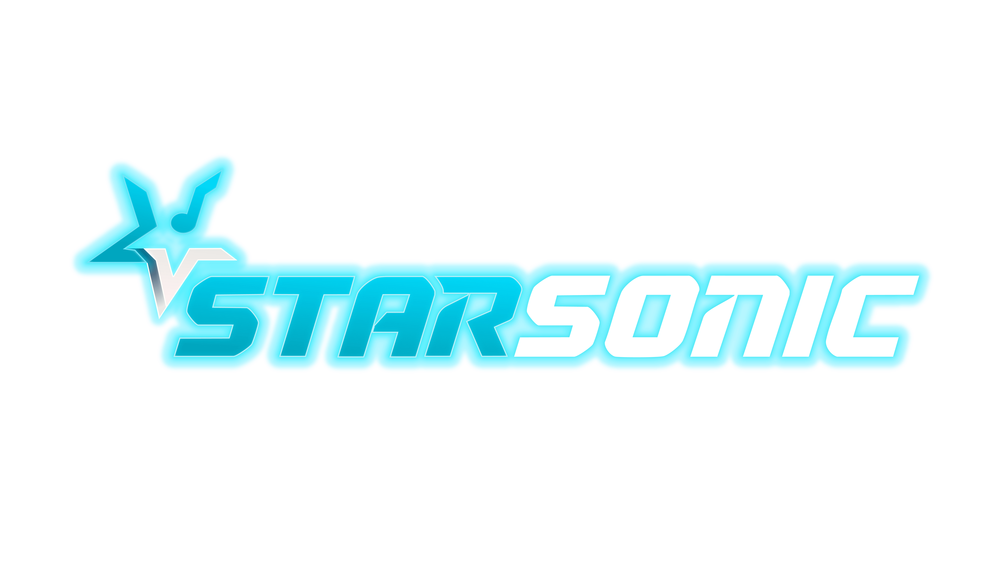

<div align="center">



# Star Sonic

**Plataforma de criação musical com IA** — componha músicas, letras, vozes, capas e vídeos a partir de um único fluxo guiado.

Construído com Next.js 14 · TypeScript · Supabase · Tailwind CSS

</div>

---

## Sobre

Star Sonic é o front-end web de uma plataforma de criação musical assistida por IA. A partir de um wizard guiado (o **Compositor**), o usuário descreve a identidade da música, a voz e o conteúdo desejados, e a aplicação orquestra diferentes serviços de IA para gerar **música, letra, vídeo clipe, capa e avatar**.

A interface é toda em português do Brasil e reproduz, página a página, um protótipo HTML de design (`starsonic-prototipo-v6 (2).html`, na raiz do repositório) que serve como fonte de verdade visual.

> [!NOTE]
> O app roda atualmente em **modo "dados públicos / demo"**: não há login. A autenticação está desativada (`src/middleware.ts`), as tabelas do Supabase têm políticas RLS de leitura pública, e `getProfile()` retorna o primeiro perfil cadastrado como usuário demo.

## Funcionalidades

- **Compositor** — wizard de 3 etapas (identidade, voz, conteúdo) com revisão editável da letra antes de gerar a música.
- **Letrista** — geração de letras a partir de tema e estilo.
- **Vocalista / Cover Studio** — estilos vocais e versões cover.
- **Avatar Studio** — geração de avatares em vídeo.
- **Mídia** — geração de vídeos e imagens (capas).
- **Catálogo & Criações** — explorar músicas públicas e gerenciar as próprias criações.
- **Distribuição** — vitrine de DSPs (plataformas de streaming) para publicação.
- **Planos & Perfil** — planos de assinatura e conta do usuário.

## Integrações de IA

As chamadas aos serviços externos ficam em rotas de API server-side (`src/app/api/*`), de forma que as chaves **nunca são expostas ao browser**. O acompanhamento das gerações é feito por _polling_ de status.

| Serviço | Uso | Rotas |
| --- | --- | --- |
| **Suno** | Música, letra e vídeo clipe | `api/criar-musica/*` |
| **KIE** | Imagens (capas) e vídeo | `api/kie/*` |
| **HeyGen** | Avatares em vídeo | `api/heygen/*` |
| **WaveSpeed** | Vídeo | `api/wavespeed/*` |

## Stack

- **Framework:** [Next.js 14](https://nextjs.org/) (App Router, Server Components)
- **Linguagem:** TypeScript (`strict`)
- **Banco de dados:** [Supabase](https://supabase.com/) (Postgres + RLS)
- **Estilo:** Tailwind CSS + CSS custom properties e estilos inline (espelhando os tokens de design do protótipo)
- **Animação / gráficos:** [Motion](https://motion.dev/) e [OGL](https://github.com/oframe/ogl) (efeitos WebGL)
- **Fontes:** Orbitron, Sora e JetBrains Mono (via Google Fonts)

## Arquitetura

**Fluxo de dados.** Server Components buscam os dados diretamente via _helpers_ tipados em [`src/lib/data.ts`](src/lib/data.ts) (`getProfile`, `getCreations`, `getCatalogSongs`, `getPlans`, `getDsps`, `getPresets`, `getNotifications`). Cada helper cria um cliente Supabase de servidor e retorna linhas tipadas. As páginas chamam esses helpers em paralelo (`Promise.all`) e repassam dados puros como props. Não há gerenciador de estado global nem fetching no cliente.

**Servidor vs. cliente.** As páginas (`src/app/(app)/*/page.tsx`) e o layout do app são Server Components assíncronos e concentram todas as leituras do banco. Apenas três componentes são _client components_ (`Sidebar`, `Header`, `ContextualPanel`) — usam `usePathname()` para destacar a rota ativa e o painel contextual.

**Roteamento & painel contextual.** O shell do app vive no route group `(app)`. [`src/lib/nav.ts`](src/lib/nav.ts) é o mapa central de metadados de rota: `PAGE_META` associa cada segmento → painel contextual, breadcrumb e ícone ativo da sidebar. Ao adicionar uma rota, registre-a em `PAGE_META`.

**Tipos.** [`src/lib/types.ts`](src/lib/types.ts) espelha à mão o schema do Supabase ([`supabase/schema.sql`](supabase/schema.sql)) — mantenha os dois em sincronia.

```
src/
├── app/
│   ├── (app)/            # Shell autenticado: dashboard, compositor, catálogo, etc.
│   ├── (auth)/           # Login e cadastro (stub no modo demo)
│   └── api/              # Rotas server-side das integrações de IA
├── components/           # Componentes de UI (Sidebar, Header, Compositor, ...)
├── lib/
│   ├── data.ts           # Helpers de leitura do Supabase
│   ├── types.ts          # Tipos espelhando o schema
│   ├── nav.ts            # Metadados de rota / painel contextual
│   ├── format.ts         # Helpers de formatação (formatPlays, timeAgo, ...)
│   └── supabase/         # Clientes Supabase (server.ts / client.ts)
└── middleware.ts         # Auth (desativado no modo demo)
```

## Começando

### Pré-requisitos

- Node.js 18+ e npm
- Um projeto [Supabase](https://supabase.com/)

### Instalação

```bash
git clone <repo-url>
cd starsonic-project-front
npm install
```

### Configuração do Supabase

[`supabase/schema.sql`](supabase/schema.sql) é um script idempotente (re-executável): cole o arquivo inteiro no **SQL Editor** do Supabase e execute. Ele recria as tabelas, define as políticas RLS de leitura pública e popula os dados que substituem o conteúdo mockado do protótipo.

### Variáveis de ambiente

Copie [`.env.example`](.env.example) para `.env` e preencha:

```bash
cp .env.example .env
```

| Variável | Obrigatória | Descrição |
| --- | --- | --- |
| `NEXT_PUBLIC_SUPABASE_URL` | Sim | URL do projeto Supabase |
| `NEXT_PUBLIC_SUPABASE_ANON_KEY` | Sim | Chave anônima pública (acesso só-leitura) |
| `SUPABASE_SERVICE_ROLE_KEY` | Upload de avatar | Chave de serviço (apenas servidor) |
| `SUNO_KEY` | Música/letra/vídeo | Chave da API Suno |
| `KIE_AI_KEY` | Imagem/vídeo | Chave da API KIE |
| `HEYGEN_KEY` | Avatar | Chave da API HeyGen |
| `WAVE_SPEED_KEY` | Vídeo | Chave da API WaveSpeed |

Variáveis adicionais (URLs base, modelos e caminhos de callback) têm valores padrão no código — veja `.env.example` e as rotas em `src/app/api/*`.

> [!WARNING]
> As chaves de serviços de IA (`SUNO_KEY`, `KIE_AI_KEY`, etc.) **só devem existir no servidor** — nunca use o prefixo `NEXT_PUBLIC_` nelas. Não faça commit de chaves reais; mantenha o `.env` fora do versionamento.

### Rodando

```bash
npm run dev      # servidor de desenvolvimento
npm run build    # build de produção (também faz a checagem completa de tipos)
npm run start    # serve o build de produção
npm run lint     # ESLint
```

Abra [http://localhost:3000](http://localhost:3000) no navegador.

> [!TIP]
> Não há framework de testes configurado. `npm run build` é a verificação mais completa do projeto, já que o TypeScript está em modo `strict`.

## Convenções

- Alias de path: `@/*` → `./src/*`.
- Toda a copy de interface e os comentários de código são em **português** — mantenha novas strings consistentes.
- Ao adicionar uma necessidade de dados, crie um helper tipado em `src/lib/data.ts` (em vez de chamar o Supabase inline) e adicione o tipo correspondente em `src/lib/types.ts`.
- Para combinar com o protótipo, prefira as CSS variables e classes globais existentes (`card`, `btn-primary`, `badge`, `grad-text`) a novas utilities do Tailwind.
